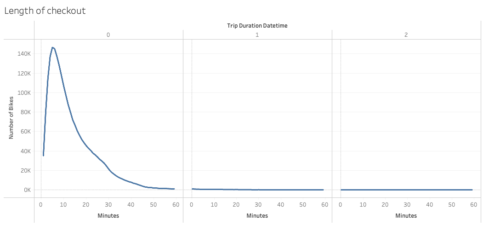
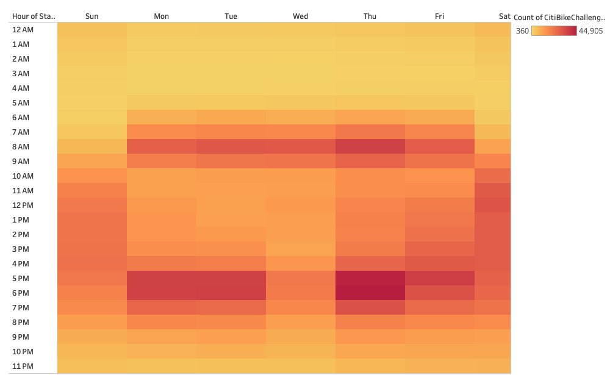
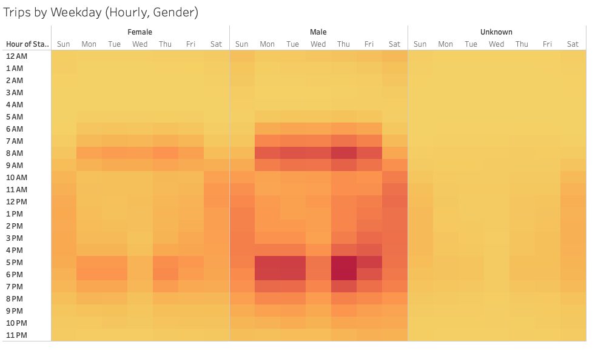
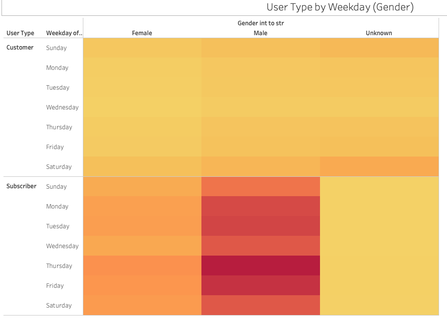
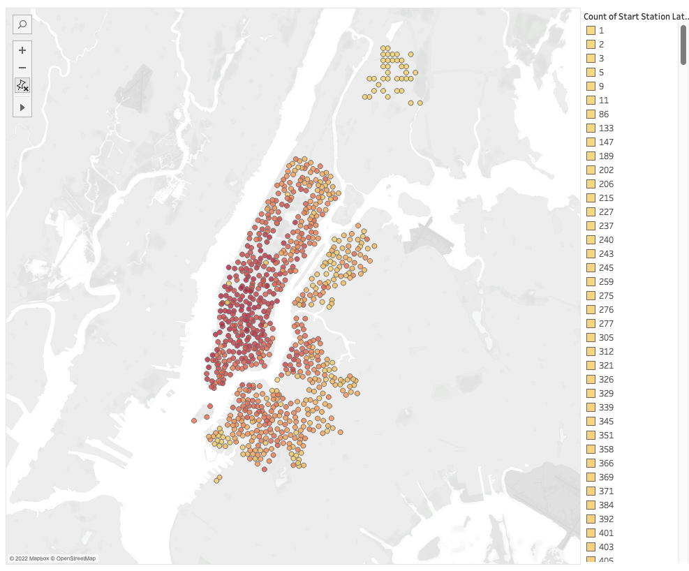
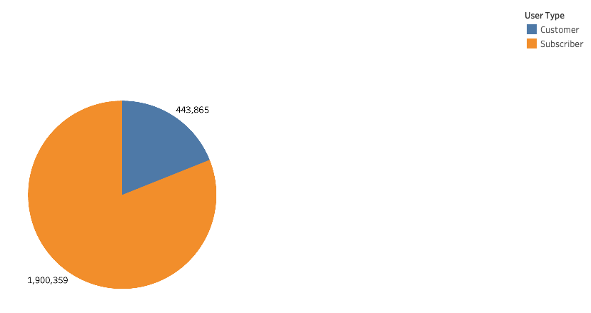

# Bikesharing with CitiBike NYC in August 2019

## Overview:

        Purpose of this Analysis is to break down the use times of the Citi Biki bikesharing program in New York City in order to extrapolate the potential profitability of starting a similar bikesharing program in Des Moines, IA.

## Results:

    A full story of the data can be viewed on Tableau Public
        [link to story](https://public.tableau.com/app/profile/jeremy.d.larsen/viz/CitibikeAugust2019_16709852356800/August2019CitibikeAnalysis#1)

    A dashboard of the general breakdown:
        [link to dashboard] (https://public.tableau.com/app/profile/jeremy.d.larsen/viz/CitibikeAugust2019_16709852356800/AugustSummaryDashboard?publish=yes)

    Figure 1 - Trip Duration Breakdown
    
        This Figure shows the amount of time bikes are rented for the CitiBike New York program. As shown the vast majority of trips are relatively short between 3 and 10 minutes.

    Figure 2 - Trip Duration by Gender
        [image](data/images/Fig2.png)
        This Figure is the same breakdown as Figure 1 but is taken a step further with a breakdown by gender.

    Figure 3 - Heatmap of Checkout times by Weekday
    
        This Figure shows the amount of trips taken each weekday based on the starting time of the checkout. It shows a trend that the number of bike checkouts is greater Monday through Friday with checkouts being more common around the standard 9-5 times that users would be traveling to and from their workplaces.

    Figure 4 - Heatmap of Checkout times by Weekday and Gender
    
        This Figure is the same as Figure 3 but further broken down by gender.

    Figure 5 - Total bike use by Weekday broken down by User Type and Gender
    
        This Figure shows the overall use of the CitiBike program broken down by customers being subscribers or not and also a separation fo the data by gender. It reinforces what Figure 3 and 4 show with monday through Friday being the peak days. This visualization also show that the vast majority of users are subscribers and male.

    Figure 6 - Start Locations by Frequency
    
        This Figure shows the locations of the checkouts with the color denoting the frequency with which they are used. Showing the main downtown concentration of locations are more popular.

    Figure 7 - Users by Type
    
        This Figure shows that the vast majority of users are subscribers. Within the story (link above) the sections of the visualization are also showing a breakdown of the genders within each User Type. This graph shows similar data to Figure 5 with a focus on the number of users instead of the weekday.

## Summary:

    This analysis showed that the vast majority of users were both subscribers and used the program as a means of transportation to and from their workplaces. The analysis was limited to amount of use and broken down by gender. Two additional studies added to the analysis (Figure 6, and Figure 7) show the most used start locations and the number of users that subscribe to the service vs simply use the bikes on a transactional basis.
    The only drawback to this analysis is the outlook of wear and tear on each bike. No data was visualized that exemplified the amount each bike was used, which would lead to the understanding of approximate repair schedules for the bikes.
